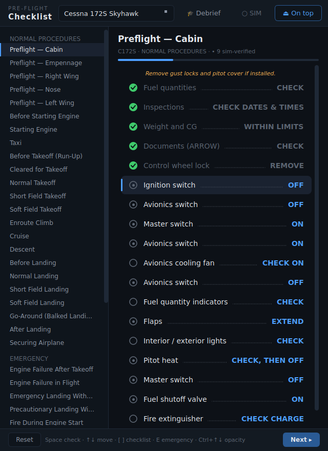
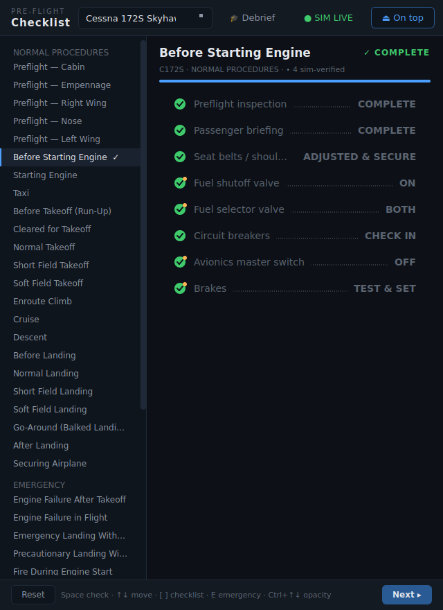

# MSFS Flight Checklist

A sleek, dark, minimal electronic checklist app built with PyQt6, designed to run
alongside Microsoft Flight Simulator 2024 so you can learn and practice real
procedures — preflight, run-up, takeoff, landing, and emergencies.



## Aircraft

| Aircraft | Data file | Based on |
| --- | --- | --- |
| Cessna 172S Skyhawk | `data/c172s.json` | Leading Edge Aviation C172S checklist / Cessna 172S POH |
| Piper PA-28-181 Archer II | `data/pa28_181.json` | Northampton Airport & mattbeyer.com Archer II checklists / Piper POH |

Both include the full **normal procedures** (cabin + exterior preflight, engine
start, taxi, run-up, takeoff variants, climb, cruise, descent, landing variants,
go-around, after landing, shutdown), **emergency procedures** (engine failure,
engine/electrical/cabin/wing fire, emergency landing, spin recovery on the
Archer), **abnormal procedures** (alternator/electrical problems, flat tires,
flooded start, lost procedure), and a **V-speeds reference** page.

> ⚠️ For simulation and training familiarization only — not for real-world
> flight. Always use the POH/AFM for the actual aircraft you fly.

## Install & run

```bash
pip install -e ".[checklist]"
msfs-checklist          # or: python -m checklist_app
```

## Live sim verification ⚡

When MSFS is running on the same machine, the checklist connects to it through
the repo's SimConnect layer and **items check themselves when you actually do
them in the cockpit**. Flip the real battery master on and "Master switch — ON"
ticks itself; run the throttle to 1800 RPM and the run-up item confirms.



- The **● SIM** chip in the header shows the link state (green = live, click
  to retry). Everything still works fully manually when the sim is offline.
- Items with a small dot inside their circle are sim-verifiable (~110 across
  the two aircraft). Amber dot = the sim is watching for it.
- Verification is **strict flow order**: only the *current* item auto-checks,
  so skipping ahead in the cockpit doesn't silently tick later items — exactly
  how an instructor runs a flow. Non-verifiable items (briefings, visual
  checks) still take a Space/click, then the flow continues.
- Auto-checked items get an amber corner badge so you can tell sim-confirmed
  steps from manually acknowledged ones.
- Conditions live in the aircraft JSON as simple `"verify"` expressions, e.g.
  `"ELECTRICAL_MASTER_BATTERY == 1"` or ranges like
  `["GENERAL_ENG_RPM:1 >= 1650", "GENERAL_ENG_RPM:1 <= 1950"]` — add your own
  for new aircraft using SimVar names from the MSFS SDK.

Requires the base package's `SimConnect` dependency (installed with
`pip install -e .`) and MSFS loaded into a flight; it degrades to a grey
"○ SIM" chip anywhere else.

## Post-flight debrief 🎓

While the sim link is live, a flight recorder rides along: a 1 Hz telemetry
trace (speed, altitude, RPM, flaps, throttle/mixture, on-ground) plus derived
events — engine start/stop, takeoff with **rotation speed**, touchdown with
**descent rate** (computed from altitude deltas, so it's unit-safe), and
limit exceedances measured against the aircraft's own V-speeds (Vne, Vno,
flaps above Vfe). Every checklist action is logged too, including whether the
sim verified it live or you checked it manually.

Press **🎓 Debrief** any time:

- **Local stats** appear instantly and work offline: takeoffs/landings with
  numbers, max speed/altitude, exceedance warnings, checklist completion.
- **✦ Instructor debrief** sends the flight log to Claude, which writes a
  CFI-style review in Markdown: what went well, the three most valuable
  things to work on (each tied to your numbers vs the POH numbers), a
  by-the-numbers table, and a concrete exercise for the next flight.
  Needs `ANTHROPIC_API_KEY`.
- **Save** writes the flight JSON + debrief Markdown to
  `~/.msfs_companion/flights/`; the flight log is also auto-saved when you
  close the app so a session is never lost.

## Using it with MSFS 2024

1. Run MSFS in **borderless windowed mode** (General Options → Graphics →
   Display Mode: Windowed) or on a second monitor.
2. Keep the **⏏ On top** toggle enabled (it is by default) so the checklist
   floats above the sim.
3. Use `Ctrl+↓` to make the window translucent over the cockpit, `Ctrl+↑` to
   bring it back.

## Keyboard flow

Everything is one-handed so your other hand stays on the stick/yoke:

| Key | Action |
| --- | --- |
| `Space` / `Enter` | Check the highlighted item and advance |
| `↑` / `↓` (or `K` / `J`) | Move the highlight |
| `[` / `]` (or `PgUp` / `PgDn`) | Previous / next checklist |
| `E` | Jump straight to the first emergency checklist |
| `R` | Reset the current checklist |
| `Ctrl+↑` / `Ctrl+↓` | Window opacity up / down |

Red-dotted items are **memory items** — procedures you should eventually be able
to fly without reading.

## Adding aircraft

Drop another JSON file in `src/checklist_app/data/`. Schema:

```json
{
  "name": "Aircraft Full Name",
  "short_name": "SHORT",
  "source": "where the checklist came from",
  "vspeeds": [["Vr (rotate)", "55 KIAS"]],
  "sections": [
    {
      "name": "Before Start",
      "group": "Normal",            // Normal | Emergency | Abnormal
      "items": [
        {"challenge": "Brakes", "response": "SET"},
        {"challenge": "Mixture", "response": "FULL RICH", "memory": true},
        {"kind": "note", "challenge": "If engine is warm, skip priming."}
      ]
    }
  ]
}
```

It will appear in the aircraft dropdown automatically.
