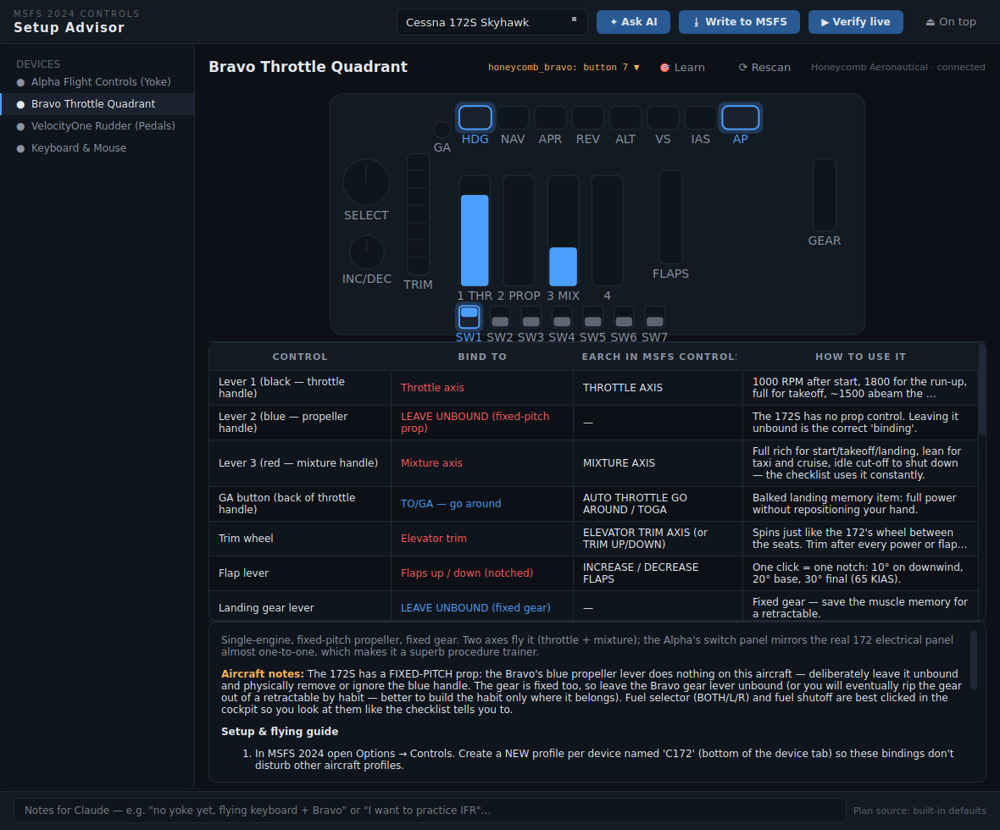
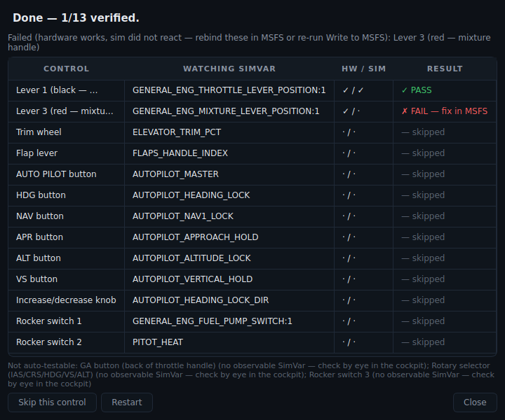

# MSFS Controls Setup Advisor

A dark, minimal PyQt6 app that replaces wrestling with the MSFS 2024 controls
menu. It knows your hardware, knows your aircraft, ships curated binding plans
that work offline, shows a **live diagram of each device that lights up as you
press the real thing**, can **write the bindings directly into your MSFS input
profiles** (with backups), and can ask **Claude** to review and tailor the
whole setup to the aircraft you're flying and the hardware actually plugged in.



## Live device visualizer

Select a device in the sidebar and you get a drawn diagram of it — the Bravo's
levers, AP panel, trim wheel, flap/gear levers and rockers; the Alpha's yoke,
hat, switch panel and magneto rotary; the pedals' rudder slide and toe brakes.
Move or press the physical control and the on-screen element lights up; axes
show live fill gauges. The raw monitor readout (top right) shows every event
as `button 7 ▼` / `axis 2 = +0.65`, so even an unmapped input is visible.

**🎯 Learn mode** makes the mapping exact for *your* unit: click a control on
the diagram, press/move the real input, done — saved to
`~/.msfs_companion/input_maps.json` and used both for highlighting and for
profile writing. (The shipped defaults are good starting points but hardware
firmware revisions vary — a one-time Learn pass per device is recommended.)

## Live binding verification ▶

After writing (or setting up bindings any way you like), **▶ Verify live**
closes the loop with MSFS running: the app walks you through each binding —
*"Now operate: Lever 1 (black — throttle handle)"* — and watches two
independent channels at once:

- **HW** — the mapped physical input actually moved (same monitor as the visualizer)
- **SIM** — the SimVar that binding should drive changed from its baseline
  (throttle lever position, battery state, flap handle index, AP annunciators, …)

Both seen → **✓ PASS**. Hardware seen but the sim silent for 6 seconds →
**✗ FAIL**, which is precisely the diagnosis of a wrong MSFS binding — rebind
that one control and re-run. With the sim closed it degrades to a
hardware-only check. A few controls (the Bravo's selector knob, spare
rockers) have no observable SimVar and are listed as check-by-eye.



## Writing bindings into MSFS

**⭳ Write to MSFS** takes the current device's plan and writes it straight
into an MSFS input profile:

1. Create a profile for the device once in MSFS (Options → Controls → new
   profile), then close MSFS (or at least leave the Controls menu).
2. The app scans the known profile locations — Steam (`%APPDATA%\Microsoft
   Flight Simulator 2024`) and Microsoft Store (WGS containers under
   `Microsoft.Limitless_8wekyb3d8bbwe`), plus MSFS 2020 equivalents — or you
   can browse to a folder.
3. You get a preview of exactly which MSFS actions will be bound to which
   joystick inputs, plus a list of the few things that must stay manual
   (e.g. the Bravo's selector-dependent inc/dec knob).
4. **Backup & Write**: the original file is copied to
   `~/.msfs_companion/profile_backups/<name>.<timestamp>.bak` first, then the
   `<Action>` bindings are injected in place (existing profile updated —
   never renamed or recreated, so the Store's `containers.index` is safe).
5. Restart MSFS and select the profile.

If anything looks wrong in-game, copy the backup over the profile file.

## Supported hardware

| Device | Detection |
| --- | --- |
| Honeycomb Alpha Flight Controls (yoke) | USB VID/PID `294B:1900` + name match |
| Honeycomb Bravo Throttle Quadrant | USB VID/PID `294B:1901` + name match |
| Turtle Beach VelocityOne Rudder (pedals) | name match (`VelocityOne Rudder`) |
| Keyboard & mouse | always present |

Detection uses `pygame`'s joystick enumeration and degrades gracefully — a
device that isn't plugged in still shows its full plan, marked *not detected*.

## What you get per aircraft

For the **Cessna 172S** and **Piper PA-28-181 Archer II** (matching the
checklist app), each device gets a binding table:

**Control → Bind to → What to search in MSFS Options → Controls → How to use it in real procedures**

with priorities (red = essential, blue = recommended, grey = optional), plus a
guidance pane: setup steps (profiles, sensitivities, clearing defaults,
turning off rudder assists) and a flow guide connecting each control to the
checklist phases — including the *teaching* bindings, like deliberately
leaving the Bravo's prop lever unbound on a fixed-pitch aircraft.

## The Claude integration

Press **✦ Ask Claude** and the app sends:

- the chosen aircraft + its V-speeds and checklist phases (from the checklist app data),
- the full hardware inventory with per-device detected/not-detected state,
- the current binding plan,
- your free-text notes ("no pedals yet", "practicing IFR", …)

The LLM (structured JSON output) returns a reviewed plan — corrected bindings,
filled gaps, keyboard substitutions for missing hardware — and refreshed
coaching. The result replaces the table in place; the status bar shows the plan
source (the model that produced it).

### Choosing an LLM provider

Set `MSFS_COMPANION_LLM` (this applies to the flight debrief too):

| `MSFS_COMPANION_LLM` | Backend | Needs | Default model |
|---|---|---|---|
| `anthropic` (default) | Claude | `ANTHROPIC_API_KEY` | `claude-opus-4-8` |
| `openai` | OpenAI or any hosted OpenAI-compatible API | `OPENAI_API_KEY` | `gpt-4o` |
| `local` (aliases: `ollama`, `llama`) | A local OpenAI-compatible server — Ollama, LM Studio, llama.cpp, vLLM | nothing (runs offline) | `llama3.1` |

- `MSFS_COMPANION_MODEL` overrides the model for any provider.
- `MSFS_COMPANION_LLM_BASE_URL` overrides the endpoint (local default
  `http://localhost:11434/v1`, Ollama's OpenAI-compatible port).
- `openai`/`local` need the `openai` package: `pip install -e ".[controls,openai]"`.

Example — run fully offline with a local Llama via Ollama:

```bash
ollama serve &            # start the local server
ollama pull llama3.1      # once
export MSFS_COMPANION_LLM=local
```

Without any credentials the app still fully works using the built-in plans and
tells you exactly which key to set (or to switch to a local model).

## Install & run

```bash
pip install -e ".[controls]"
setx ANTHROPIC_API_KEY "sk-ant-..."   # optional, enables Ask (Windows); or use MSFS_COMPANION_LLM
msfs-controls                          # or: python -m controls_app
```

Keep it on a second monitor (or pinned on top) next to the checklist app:
`msfs-checklist` teaches you *what* to do, `msfs-controls` teaches you *which
physical control does it*.

## Adding aircraft or hardware

- New aircraft: drop a plan JSON in `src/controls_app/data/plans/` (same shape
  as `c172s.json`).
- New device: add a `DeviceProfile` in `src/controls_app/devices.py` with its
  inputs and USB IDs, then reference its id in the plan files. Claude picks
  both up automatically — the advisor prompt is built from these definitions.
