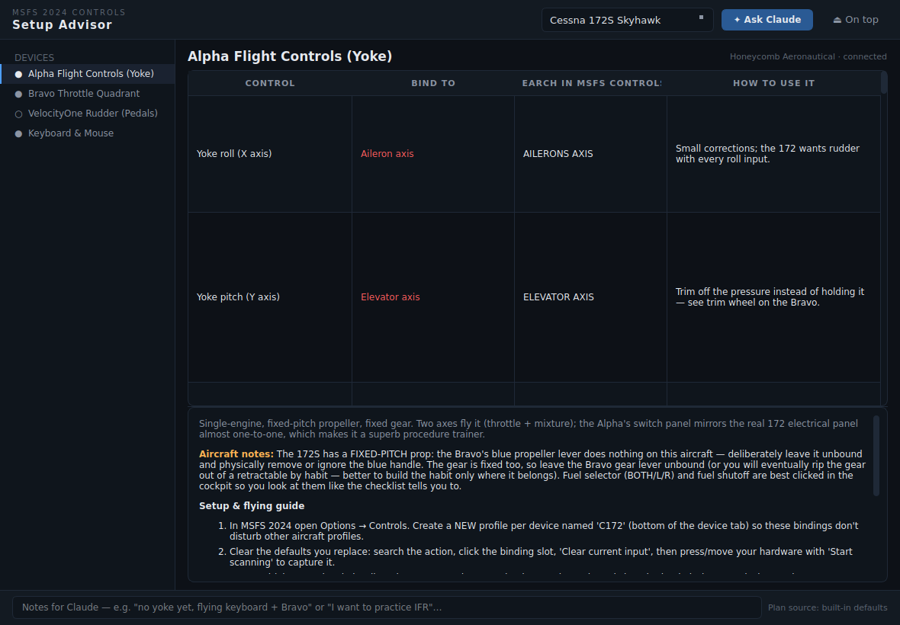

# MSFS Controls Setup Advisor

A dark, minimal PyQt6 app that replaces wrestling with the MSFS 2024 controls
menu. It knows your hardware, knows your aircraft, ships curated binding plans
that work offline — and can ask **Claude** to review and tailor the whole setup
to the aircraft you're flying and the hardware actually plugged in.



## Supported hardware

| Device | Detection |
| --- | --- |
| Honeycomb Alpha Flight Controls (yoke) | USB VID/PID `294B:1900` + name match |
| Honeycomb Bravo Throttle Quadrant | USB VID/PID `294B:1901` + name match |
| Turtle Beach VelocityOne Rudder (pedals) | name match (`VelocityOne Rudder`) |
| Keyboard & mouse | always present |

Detection uses `pygame`'s joystick enumeration and degrades gracefully — a
device that isn't plugged in still shows its full plan, marked *not detected*.

## What you get per aircraft

For the **Cessna 172S** and **Piper PA-28-181 Archer II** (matching the
checklist app), each device gets a binding table:

**Control → Bind to → What to search in MSFS Options → Controls → How to use it in real procedures**

with priorities (red = essential, blue = recommended, grey = optional), plus a
guidance pane: setup steps (profiles, sensitivities, clearing defaults,
turning off rudder assists) and a flow guide connecting each control to the
checklist phases — including the *teaching* bindings, like deliberately
leaving the Bravo's prop lever unbound on a fixed-pitch aircraft.

## The Claude integration

Press **✦ Ask Claude** and the app sends:

- the chosen aircraft + its V-speeds and checklist phases (from the checklist app data),
- the full hardware inventory with per-device detected/not-detected state,
- the current binding plan,
- your free-text notes ("no pedals yet", "practicing IFR", …)

Claude (`claude-opus-4-8`, structured JSON output) returns a reviewed plan —
corrected bindings, filled gaps, keyboard substitutions for missing hardware —
and refreshed coaching. The result replaces the table in place; the status bar
shows the plan source.

Requires the `ANTHROPIC_API_KEY` environment variable
(get one at <https://platform.claude.com>). Without it the app still fully
works using the built-in plans and tells you why the button can't run.

## Install & run

```bash
pip install -e ".[controls]"
setx ANTHROPIC_API_KEY "sk-ant-..."   # optional, enables Ask Claude (Windows)
msfs-controls                          # or: python -m controls_app
```

Keep it on a second monitor (or pinned on top) next to the checklist app:
`msfs-checklist` teaches you *what* to do, `msfs-controls` teaches you *which
physical control does it*.

## Adding aircraft or hardware

- New aircraft: drop a plan JSON in `src/controls_app/data/plans/` (same shape
  as `c172s.json`).
- New device: add a `DeviceProfile` in `src/controls_app/devices.py` with its
  inputs and USB IDs, then reference its id in the plan files. Claude picks
  both up automatically — the advisor prompt is built from these definitions.
